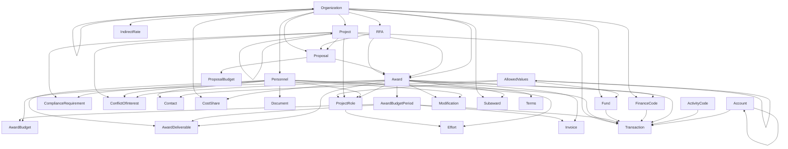

# AI4RA-UDM

A standardized data model for research administration that provides universal terms and definitions, helping institutions map their local data to a common schema for dashboards and analytics.

## Schema Overview

The AI4RA Unified Data Model (UDM) covers all major domains of research administration:

- **Core Entities**: Organization, Personnel, Contact, AllowedValues
- **Project Management**: Project, RFA, Proposal, ProposalBudget
- **Award Management**: Award, Modification, Terms, AwardBudgetPeriod, AwardBudget, Subaward
- **Financial Tracking**: Fund, Account, FinanceCode, ActivityCode, Transaction, IndirectRate
- **Deliverables**: Invoice, AwardDeliverable
- **Personnel & Effort**: ProjectRole, Effort
- **Compliance**: ComplianceRequirement, ConflictOfInterest
- **Documentation**: Document, ActivityLog, DataDictionary

### Naming Conventions

The UDM follows consistent naming conventions throughout the schema:

**Table Names**: PascalCase
- Examples: `AllowedValues`, `ProjectRole`, `ComplianceRequirement`, `AwardBudgetPeriod`
- Multi-word tables use no separators: `AwardDeliverable`, `ConflictOfInterest`

**Column Names**: Snake_case
- Examples: `Allowed_Value_ID`, `Project_ID`, `Is_Active`, `Date_Created`
- Primary keys: `TableName_ID` format (e.g., `Personnel_ID`, `Award_ID`, `Organization_ID`)
- Foreign keys: Match the referenced primary key name (e.g., `Parent_Organization_ID` references `Organization.Organization_ID`)
- Boolean flags: Prefixed with `Is_` (e.g., `Is_Active`, `Is_Primary`)
- Audit fields: `Date_Created`, `Last_Modified_Date`, `Last_Modified_By`, `Created_By_Personnel_ID`

**Rationale**: This mixed approach (PascalCase for tables, Snake_case for columns) is a common and widely-accepted convention in MySQL/Dolt environments. Snake_case for columns provides better readability and case-insensitive matching, while PascalCase for tables clearly distinguishes entity names.

### Key Design Principles

1. **Referential Integrity**: All foreign keys include proper constraints with CASCADE or SET NULL behaviors
2. **Audit Trails**: Timestamps and user tracking on critical tables
3. **Flexible Lookups**: `AllowedValues` table provides configurable controlled vocabularies
4. **Self-Referencing Hierarchies**: Support for organizational and project hierarchies
5. **Comprehensive Financial Tracking**: Detailed budget periods, transactions, and cost tracking
6. **Compliance Support**: Built-in tables for IRB, IACUC, COI, and other regulatory requirements

<!-- ERD_START -->
## Entity Relationship Diagram

<!-- ERD_END -->
